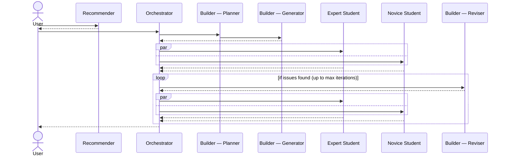

```mermaid
sequenceDiagram
    actor User
    participant REC as Recommender
    participant ORC as Orchestrator
    participant PLAN as Builder — Planner
    participant GEN as Builder — Generator
    participant EXP as Expert Student
    participant NOV as Novice Student
    participant REV as Builder — Reviser

    User->>REC:
    REC-->>User:
    User->>ORC:

    ORC->>PLAN:
    PLAN->>GEN:
    GEN-->>ORC:

    par
        ORC->>EXP:
    and
        ORC->>NOV:
    end

    EXP-->>ORC:
    NOV-->>ORC:

    loop if issues found (up to max iterations)
        ORC->>REV:
        REV-->>ORC:
        par
            ORC->>EXP:
        and
            ORC->>NOV:
        end
        EXP-->>ORC:
        NOV-->>ORC:
    end

    ORC-->>User:
```
