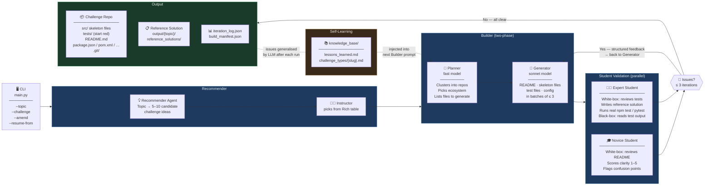
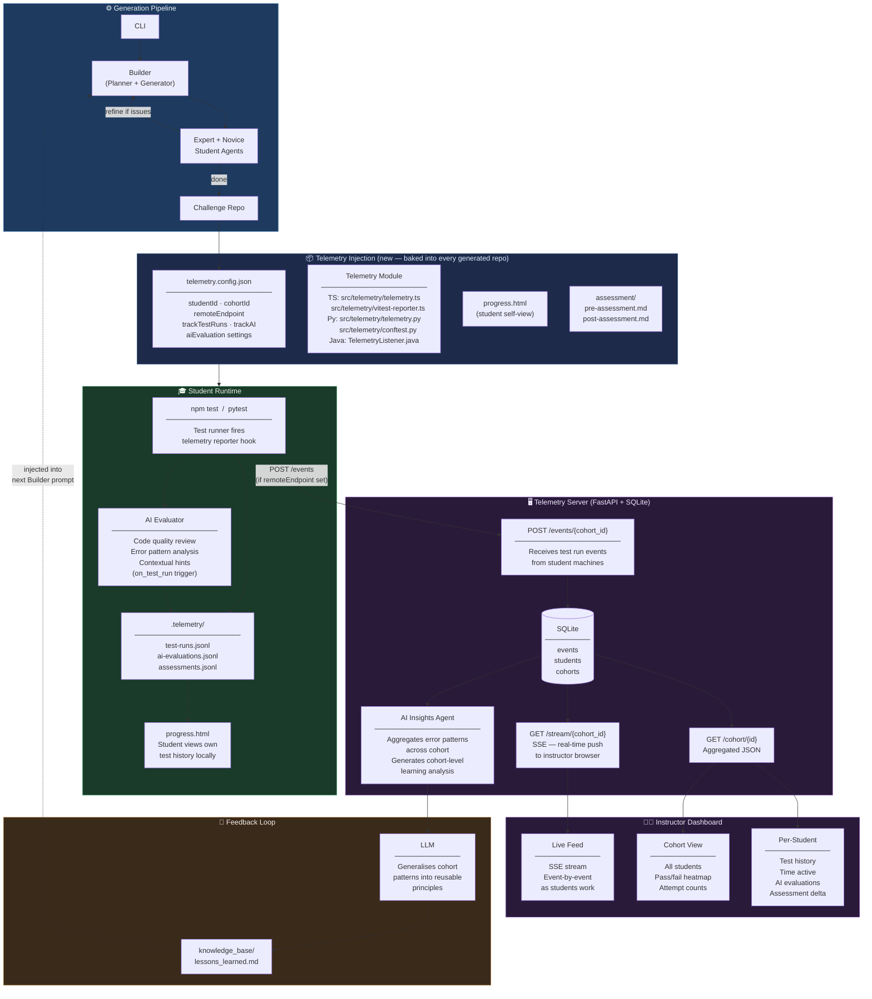
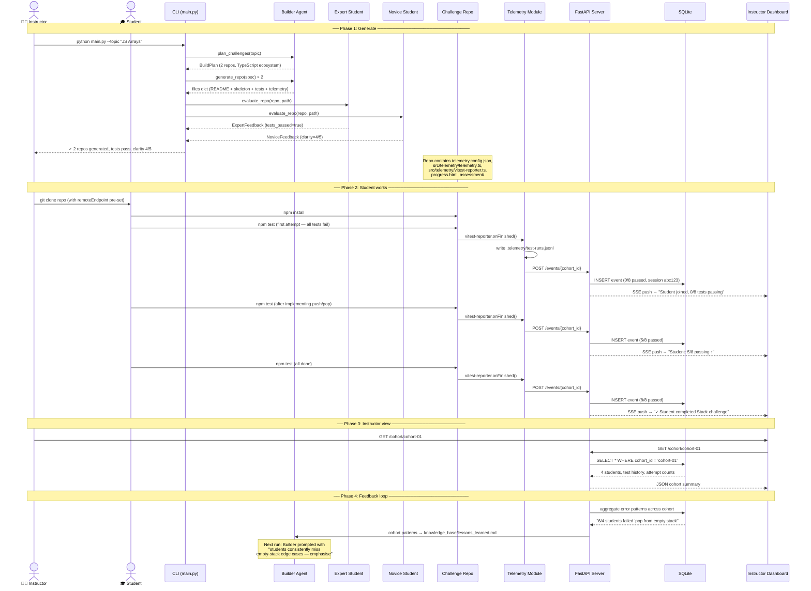
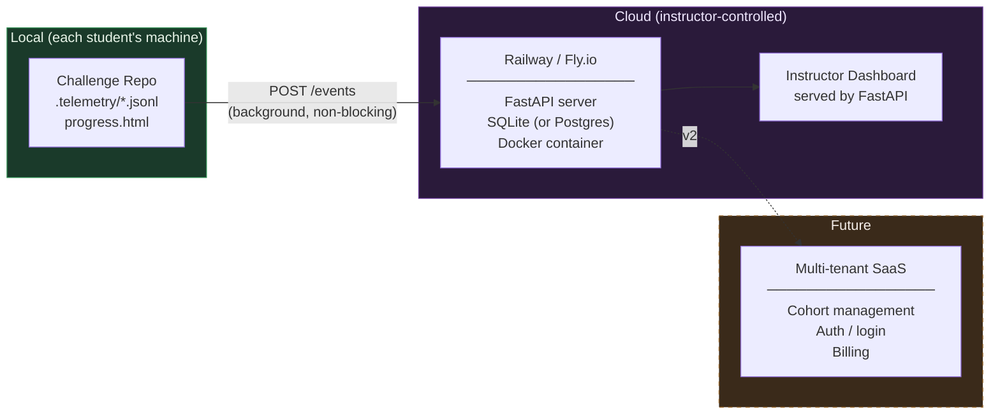

# System Architecture

This document describes the full architecture of the Challenge Generation Platform — the existing agentic generation pipeline, the planned telemetry system, and how they connect through a feedback loop.

---

## 1. Challenge Generation Pipeline

The existing system: a multi-agent Python pipeline that generates, validates, and iteratively refines testable coding challenge repos for bootcamp students.



**Key properties:**

| Property | Detail |
|---|---|
| All LLM calls | Route through `tools/llm_client.py` → Anthropic API or Claude CLI |
| Builder batching | Files generated in batches of ≤ 3; earlier files passed as context to later batches |
| Parallelism | Expert + Novice run concurrently via `ThreadPoolExecutor` |
| Resume support | `build_manifest.json` written after initial build; `--resume-from` skips Builder |
| Self-learning | `lessons_learned.md` appended after every run; injected into next Builder prompt |

---

## 2. Full System — Generation + Telemetry

The next phase: every generated repo ships with a telemetry system baked in. Student activity flows to a server; aggregated insights close the loop back into the Builder.



---

## 3. Demo Flow — End-to-End Sequence

What happens during a live demo, from a single CLI command to an instructor's dashboard updating in real time.



---

## 4. Telemetry Event Schema

Every test run produces a newline-delimited JSON event appended to `.telemetry/test-runs.jsonl`:

```json
{
  "type": "test_run",
  "timestamp": "2025-03-16T09:15:00.000Z",
  "sessionId": "1710580500000-abc1234",
  "studentId": "alice",
  "cohortId": "cohort-01",
  "challenge": "Stack",
  "testFile": "src/Stack/Stack.test.ts",
  "results": [
    { "name": "should push items onto the stack",      "status": "passed",  "duration": 12 },
    { "name": "should pop in LIFO order",              "status": "passed",  "duration": 8  },
    { "name": "should return undefined on empty pop",  "status": "failed",  "duration": 5,
      "error": "Expected undefined, received null" }
  ],
  "summary": { "total": 8, "passed": 5, "failed": 3, "duration": 47 }
}
```

AI evaluations extend this schema in `.telemetry/ai-evaluations.jsonl`:

```json
{
  "type": "ai_evaluation",
  "timestamp": "2025-03-16T09:15:02.000Z",
  "sessionId": "1710580500000-abc1234",
  "challenge": "Stack",
  "evaluation": {
    "errorPatterns": {
      "identified": ["null-vs-undefined-confusion", "off-by-one-on-empty-check"],
      "rootCause": "Student is checking `this.size === 0` after decrement instead of before"
    },
    "hints": [
      {
        "testName": "should return undefined on empty pop",
        "hint": "Think about when to check if the stack is empty — before or after changing the index?",
        "severity": "gentle"
      }
    ],
    "learningProgress": {
      "conceptsMastered": ["class-structure", "push-logic"],
      "conceptsStruggling": ["boundary-conditions", "index-management"]
    }
  }
}
```

---

## 5. Deployment Topology



| Phase | Infrastructure | Effort |
|---|---|---|
| **Now** | Local `.telemetry/` + `progress.html` only | Zero — already generated |
| **Demo** | FastAPI server running on localhost | ~3 hrs |
| **v1** | Single Railway/Fly.io deployment, SQLite | +`Dockerfile` + deploy config |
| **v2** | Postgres, cohort auth, multi-tenant | Full product build |
